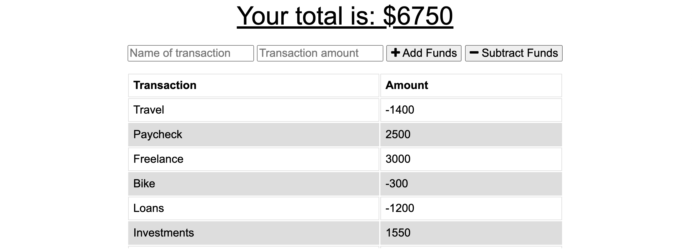
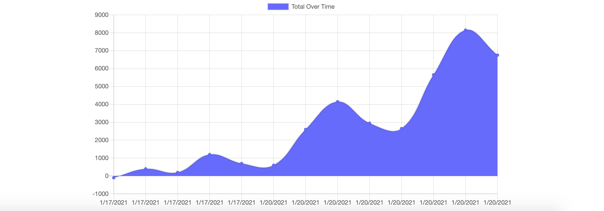

# Budget-Tracker

## Description

With this Budget Tracker App, the user will be able to add expenses and deposits to their budget with or without an internet connection. 

When entering transactions offline, they will be stored. Any withdrawals or deposits will be shown on the page, then added to their transaction history when their connection is back online.

## Table of Contents

* [Project Summary](#description)
* [Preview](#preview)
* [Deployed App](#app)
* [Contact Me](#questions)
  
## Preview

Below are some example images of the app!

## App

Here is a link to the deployed app on Heroku: 
[Budget Tracker App](https://boss-budgeting.herokuapp.com/)

## Questions?

If you have any questions, please don't hesitate to reach out!

Github: [habby-bit](https://github.com/habby-bit)
  
Email: [habbyolu@gmail.com](habbyolu@gmail.com)
